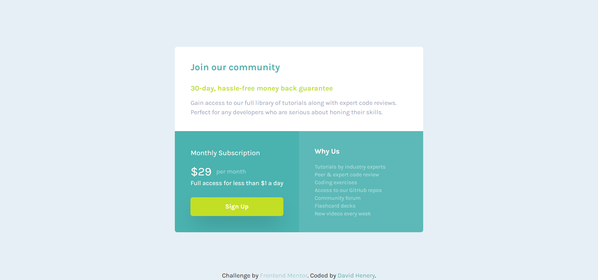

# Frontend Mentor - Single price grid component solution

This is a solution to the [Single price grid component challenge on Frontend Mentor](https://www.frontendmentor.io/challenges/single-price-grid-component-5ce41129d0ff452fec5abbbc). Frontend Mentor challenges help you improve your coding skills by building realistic projects. 

## Table of contents

- [Overview](#overview)
  - [The challenge](#the-challenge)
  - [Screenshot](#screenshot)
  - [Links](#links)
- [My process](#my-process)
  - [Built with](#built-with)
  - [What I learned](#what-i-learned)
  - [Continued development](#continued-development)
  - [Useful resources](#useful-resources)
- [Author](#author)


## Overview

### The challenge

Users are able to:

- View the optimal layout for the component depending on their device's screen size
- See a hover state on desktop for the Sign Up call-to-action

### Screenshot




### Links

// LINKS TO BE ADDED
- Solution URL: [Add solution URL here](https://your-solution-url.com)
- Live Site URL: [Add live site URL here](https://your-live-site-url.com)

## My process

### Built with

- Semantic HTML5 markup
- Flexbox
- CSS Grid
- Mobile-first workflow
- [Tailwind-Css](https://reactjs.org/) - CSS Utility Library


### What I learned

My aim with this project was to practice using tailwind for the first time, and even though it was a small project I learn't a lot about tailwind from building this project.

One of the main things I can take away for this project, is that I can see the immediate benefits of using utility classes to help build CSS UI a lot quicker than it would be to build them from scratch.
For instance by default tailwind already removes the default stylings of buttons, like removing the background color and the outline but also sets the font-family to the main font-family of the project. Where as before hand we had to do this manually, and then apply our styles, but now we can just add the classes to apply our styles straight away without having to remove the defaults.

Another main benefit is using the tailwind config file, which is very customizable and can help to control the overall theme of the project. This can come in handy for many reasons. For example, it allows to create your custom values and spacing and it also lets you create your colour pallet for your project. This is very usefull especially when working with others because anyone can see whats being used thoughout the project and this would help keep the UI consistent by making sure we use the same values and styles.

Here is the config file I used,
it has a custom colour pallet along
with some custom values that I added to the tailwind default values. It also has one custom media query which I also added to the default media queries.

```js
/** @type {import('tailwindcss').Config} */
const colors = require("tailwindcss/colors");

module.exports = {
  content: ["./build/*.html"],
  theme: {
    colors: {
      cyan: "hsl(179, 62%, 43%)",
      brightyellow: "hsl(71, 73%, 54%)",
      lightgray: "hsl(204, 43%, 93%)",
      grayishblue: "hsl(218, 22%, 67%)",
      white: colors.white,
      red: colors.red,
    },
    extend: {
      screens: {
        mob: "20.62em",
        lrgMob: "23.62em"
      },
      fontFamily: {
        karla: ["Karla", "sans-serif"],
      },
      spacing: {
        25: "102px",
      },
      maxWidth: {
        635: "635px",
      },
      gridTemplateRows: {
      layout: "216px 259px",
      },
    },
  },
  plugins: [],
};
```

### Continued development

Of course, these are just some of the benefits and features of using tailwind, and I look forward to learning and discovering more about it and using more complex features in bigger projects in the future.


### Useful resources

- [Tailwind Documentation](https://tailwindcss.com/docs/installation) - This is the documention for tailwind and it helped massively, and I kept referencing it and learning more things about it as I was building this project. Also if you don't know the name of the utility classes you need, you can just search for the css property in the docs and it will show you the equivalent tailwind class that you need, as well as more information about it.

## Author

- Website - [David Henery](https://www.your-site.com)
- Frontend Mentor - [@David-Henery4](https://www.frontendmentor.io/profile/David-Henery4)
- linkedin - [David Henery](https://www.linkedin.com/in/david-henery-725458241)


